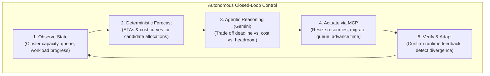
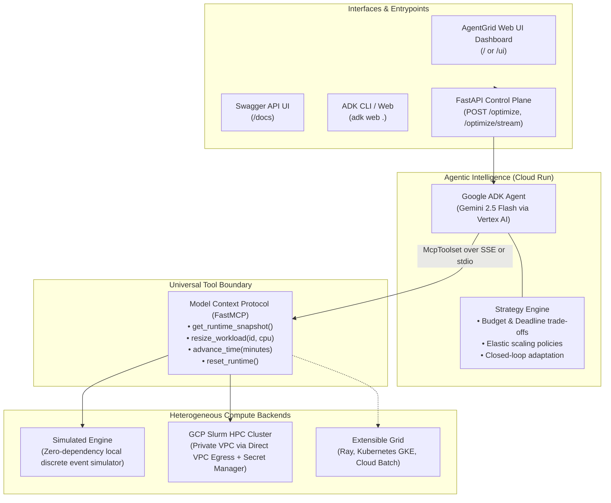
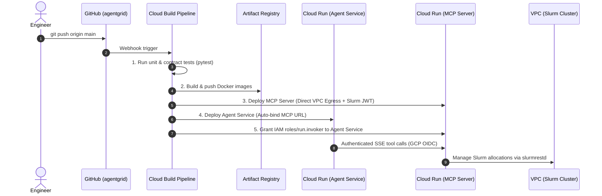

# AgentGrid

[](https://antigravity.google)
[](LICENSE)
[](https://www.python.org/)
[](https://cloud.google.com/)

> 🚀 **Built and powered with Google Antigravity** — the next-generation agentic AI platform empowering engineers to design, build, and deploy autonomous agents, closed-loop systems, and intelligent cloud infrastructure at scale.

**An open-source autonomous control plane for heterogeneous compute infrastructure.**

> **"Give the system a business objective, not a resource request."**

AgentGrid replaces static, manual resource provisioning with **autonomous, closed-loop AI agents** that dynamically observe, resize, and optimize compute workloads across Slurm clusters, Ray, and Cloud environments to meet deadlines at minimal cost.

---

## The Problem: The High Cost of Guessing Compute

In modern AI training, Monte Carlo simulations, and HPC research, resource allocation is fundamentally broken:

* **The Overprovisioning Tax**: Engineers routinely overestimate CPU, GPU, and memory requests (`--cpus-per-task`, `--mem`) to prevent job crashes, wasting up to 40% of cloud budgets.
* **Deadlines vs. Costs**: Workloads have strict deadlines and financial budgets. Traditional schedulers (Slurm, Kubernetes) only execute static queues—they cannot reason about trade-offs between job completion time and resource expenditure.
* **Dumb Autoscaling**: Conventional autoscalers react rigidly to raw metrics (e.g., `CPU > 80%`). They cannot predict workload convergence, evaluate candidate cost curves, or adapt strategy mid-run.

---

## The AgentGrid Solution: Self-Driving Compute

Instead of babysitting clusters, operators declare high-level **intent**:

```json
{
  "objective": "Run the genomic sequence analysis. Complete before 08:00 AM under $250, minimizing overall cost."
}
```

AgentGrid continuously runs an **autonomous control loop** that negotiates allocations with the underlying cluster, balancing cost curves, deadlines, and queue dynamics until completion.

### The Autonomous Agentic Loop



---

## System Architecture

AgentGrid enforces a strict boundary between **reasoning (AI)**, **tool protocol (MCP)**, and **infrastructure actuation (Runtimes)**. The agent never directly executes low-level Slurm commands or cloud APIs; it operates purely through standardized compute semantic abstractions.



---

## Deterministic vs. Agentic Responsibilities

AgentGrid is built on a core principle: **never ask an LLM to do arithmetic that deterministic software can compute with 100% precision.**

| Responsibility | Deterministic Backend (MCP / Runtime) | Agentic Brain (Gemini via ADK) |
| :--- | :---: | :---: |
| **Cluster Metrics** | Measures live CPU/GPU utilization & queue depth | Interprets cluster health & bottlenecks |
| **Candidate Projections** | Computes exact mathematical ETAs and cost curves | Evaluates which allocation meets business goals |
| **Validation** | Enforces hard quota limits and safety constraints | Reasons over policy trade-offs (cost vs. speed) |
| **Actuation** | Executes atomic API calls to Slurm / Simulator | Decides *when* and *how much* to scale |
| **Outcome Reflection** | Reports status codes, execution duration, and state | Explains rationale and summarizes mission outcome |

---

## Supported Compute Runtimes

AgentGrid features pluggable runtime adapters configured via environment variables:

| Capability | `COMPUTE_RUNTIME=simulator` | `COMPUTE_RUNTIME=slurm` |
| :--- | :--- | :--- |
| **Target Environment** | Local developer machines, CI/CD pipelines | Production GCP HPC Slurm cluster |
| **Prerequisites** | None (pure Python discrete-event simulation) | GCP VPC with `slurmrestd` + JWT secret |
| **Workload Scope** | Deterministic Monte Carlo simulation (`mc-001`) | Real cluster jobs (`SLURM_JOB_ID`) |
| **Transport Protocol** | `stdio` (local subprocess) or `sse` | `sse` on Cloud Run via Direct VPC Egress |
| **Actuation Mechanism** | State progression engine with linear scaling law | Direct `slurmrestd` REST API v0.0.41 |

---

## Quickstart (Local Development)

### 1. Prerequisites & Installation

Python 3.11+ is required.

```bash
# Clone repository
git clone https://github.com/samy-fadel/agentgrid.git
cd agentgrid

# Setup virtual environment
python3 -m venv .venv
source .venv/bin/activate
pip install -e ".[dev]"

# Configure environment
cp .env.example .env
```

### 2. Configure Gemini / Vertex AI Authentication

```bash
gcloud auth application-default login
gcloud config set project YOUR_PROJECT_ID
```

Edit your `.env` file:

```env
GOOGLE_GENAI_USE_VERTEXAI=TRUE
GOOGLE_CLOUD_PROJECT=YOUR_PROJECT_ID
GOOGLE_CLOUD_LOCATION=us-central1
AGENTIC_COMPUTE_MODEL=gemini-2.5-flash
```

### 3. Run the Agent Locally

Launch the ADK graphical playground:

```bash
adk web .
```

Open your browser at `http://localhost:8000`, select **`compute_agent`**, and instruct the agent:

> *"Run the compute workload autonomously. Meet its deadline and budget while minimizing cost. Continue observing and adapting until it finishes, then summarize the result."*

You can also run the agent directly from the command line:

```bash
adk run compute_agent
```

---

## Production Deployment on Google Cloud

AgentGrid is packaged with automated CI/CD for Google Cloud using **Cloud Build**, **Artifact Registry**, and **Cloud Run** with **Direct VPC Egress** to connect directly to private Slurm clusters.



### Deploy via CI/CD

1. **One-Time CI/CD Setup**:
   ```bash
   chmod +x scripts/setup_ci_cd.sh
   ./scripts/setup_ci_cd.sh
   ```

2. **Triggering Deployments**:
   Every push to `main` on [github.com/samy-fadel/agentgrid](https://github.com/samy-fadel/agentgrid) automatically runs tests, builds both container images, and deploys both services with end-to-end IAM authentication.

### Interacting with the Cloud Run Agent

* **Interactive Web Dashboard UI**:
  Visit `https://<AGENT_SERVICE_URL>.a.run.app/` or `/ui` in your browser.
  * Real-time streaming feed of Gemini's thinking and tool invocations via Server-Sent Events.
  * Interactive sliders for Deadline (mins), Budget (€), and Cost Minimization policy.
  * Live candidate allocation matrix with Amdahl's Law speedup curves and cost forecasts.
  * Live Slurm Ground-Truth verification card showing active job status, verified allocated CPUs, and cluster verification commands.

* **Slurm Execution Ground-Truth Verification**:
  To confirm that the agent's instructions actually executed on the cluster controller:
  ```bash
  # 1. Inspect the live job on the Slurm login node
  scontrol show job <JOB_ID> | grep -E "NumCPUs|JobState|CPUs/Task"

  # 2. Or check active job queue parameters
  squeue -j <JOB_ID> -o "%.8i %.9P %.8j %.8u %.2t %.10M %.6D %C"

  # 3. Or query the agent snapshot API
  curl -s https://<AGENT_SERVICE_URL>.a.run.app/api/snapshot | jq .
  ```

* **Interactive Swagger UI**: Visit `https://<AGENT_SERVICE_URL>.a.run.app/docs` in your browser to inspect API schemas and trigger runs interactively.
* **Synchronous REST API**:
  ```bash
  curl -X POST https://<AGENT_SERVICE_URL>.a.run.app/optimize \
    -H "Content-Type: application/json" \
    -d '{
      "objective": "Run the compute workload autonomously. Minimize cost, respect deadline, and adapt to queue pressure."
    }'
  ```
* **Real-Time Streaming API (Server-Sent Events)**:
  ```bash
  curl -N -X POST https://<AGENT_SERVICE_URL>.a.run.app/optimize/stream \
    -H "Content-Type: application/json" \
    -d '{
      "objective": "Run the compute workload autonomously. Minimize cost, respect deadline, and adapt to queue pressure."
    }'
  ```
  Streams real-time events (`tool_call`, `thinking`, `completed`) as the agent reasons and acts without client timeouts.

---

## Project Structure

```text
├── cloudbuild.yaml           # Automated CI/CD pipeline for Cloud Run
├── Dockerfile.agent          # Container definition for ADK Agent Service
├── Dockerfile.mcp            # Container definition for FastMCP Server
├── pyproject.toml            # Package metadata, dependencies, and entrypoints
│
├── compute_agent/            # Agent Service Layer
│   ├── agent.py              # Google ADK root_agent (Gemini + McpToolset)
│   ├── app.py                # FastAPI HTTP REST API, SSE streaming & Web UI
│   ├── auth.py               # GCP OIDC token generator for IAM service-to-service
│   └── static/
│       └── index.html        # Modern interactive AgentGrid Web Dashboard
│
├── src/agentic_compute/      # Domain Logic & Compute Boundary
│   ├── models.py             # Universal semantic abstractions (ClusterState, Workload)
│   ├── runtime.py            # RuntimeAdapter abstract base interface
│   ├── simulator.py          # Built-in deterministic discrete-event simulator
│   ├── slurm_adapter.py      # Production adapter for Slurm REST API (v0.0.41)
│   └── mcp_server.py         # FastMCP Server (dual SSE & stdio transports)
│
├── scripts/
│   ├── deploy_services.sh    # Cloud Run deployment & IAM binding script
│   └── setup_ci_cd.sh        # Setup script for Artifact Registry, triggers, and IAM
│
└── tests/                    # Comprehensive test suite
    ├── test_agent_service.py # API & endpoint contract tests
    ├── test_mcp_contract.py  # FastMCP interface & probe tests
    ├── test_simulator.py     # Simulator physics & deterministic progression tests
    └── test_slurm.py         # Slurm REST adapter & node discovery tests
```

---

## Roadmap

- [x] Universal compute semantic models (`ClusterState`, `WorkloadState`, `CandidateAllocation`).
- [x] FastMCP server supporting dual transports (`stdio` local, `sse` remote).
- [x] Built-in discrete-event simulation runtime.
- [x] Production Slurm REST API adapter (`slurmrestd` v0.0.41).
- [x] Automated CI/CD with Google Cloud Build & Cloud Run Direct VPC Egress.
- [ ] Multi-agent orchestration (Planner Agent + Cost Guardian Agent + Cluster Watchdog).
- [ ] Kubernetes / GKE Ray cluster runtime adapter.
- [ ] Spot / preemptible instance risk forecasting & dynamic migration.

---

## License

This project is licensed under the Apache License, Version 2.0. See the [LICENSE](LICENSE) and [NOTICE](NOTICE) files for details.
