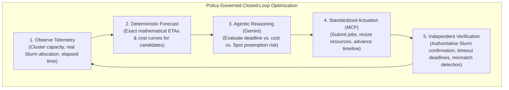
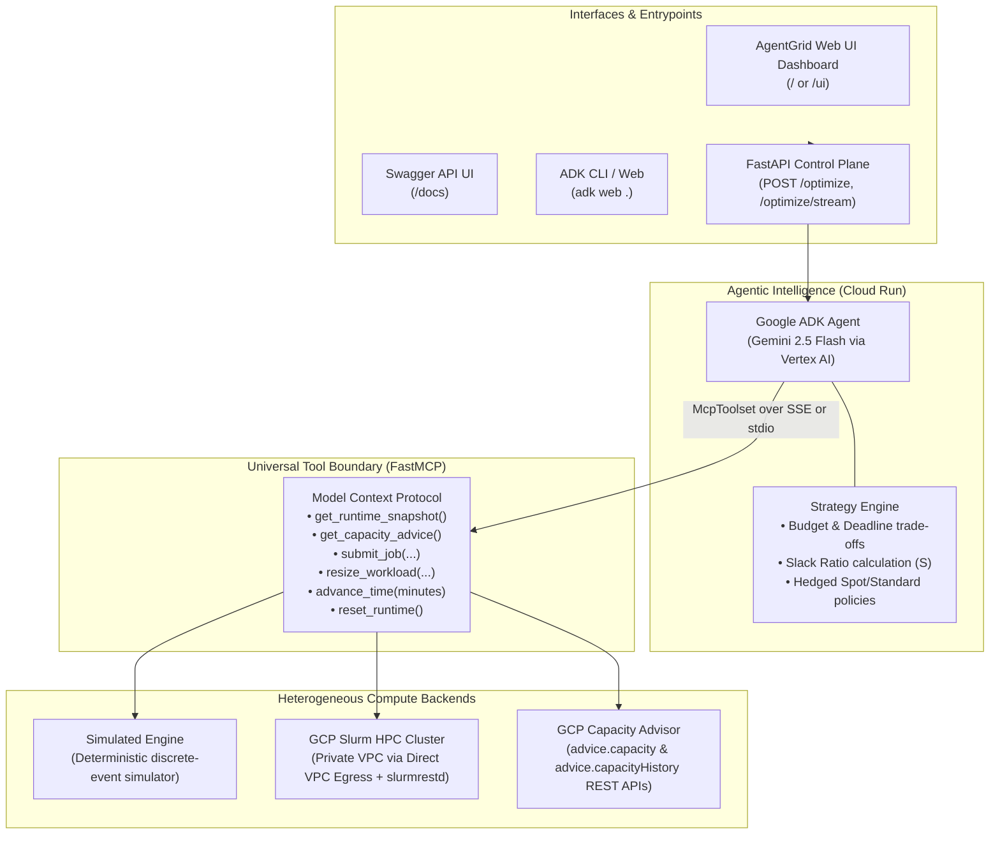
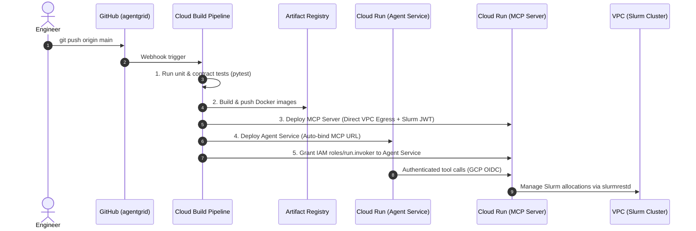

# AgentGrid

[](https://antigravity.google)
[](LICENSE)
[](https://www.python.org/)
[](https://cloud.google.com/)

> 🚀 **Built and powered with Google Antigravity** — the next-generation agentic AI platform empowering engineers to design, build, and deploy intelligent cloud infrastructure, policy-governed agentic systems, and adaptive compute optimization at scale.

**An open-source, objective-driven control plane for heterogeneous HPC and AI compute infrastructure.**

> **"Give the system a business objective, not a static resource guess."**

AgentGrid bridges business SLAs and infrastructure scheduling. By combining **deterministic forecasting software** with **policy-governed Gemini reasoning**, AgentGrid dynamically monitors, resizes, and verifies compute workloads across Slurm clusters and Cloud environments to meet execution deadlines at minimal cost.

---

## The Problem: The High Cost of Guessing Compute

In modern AI training, Monte Carlo simulations, and HPC research, resource allocation is fundamentally broken:

* **The Overprovisioning Tax**: Engineers routinely overestimate CPU, GPU, and memory requests (`--cpus-per-task`, `--mem`) to prevent job failures, wasting up to 40% of cloud budgets.
* **Deadlines vs. Costs**: Workloads have strict deadlines and financial constraints. Traditional schedulers (Slurm, Kubernetes) only manage static priority queues—they cannot reason dynamically about trade-offs between completion deadlines and budget limits.
* **Rigid Autoscaling**: Conventional reactive scalers trigger on raw infrastructure metrics (e.g., `CPU > 80%`). They cannot predict workload convergence, evaluate cost curves, assess Spot preemption risks, or verify post-actuation cluster telemetry.

---

## The AgentGrid Solution: Objective-Driven, Guardrailed Optimization

Instead of manual cluster babysitting, operators declare high-level **business intent**:

```json
{
  "objective": "Run the genomic sequence analysis. Complete before 08:00 AM under $250, minimizing overall cost."
}
```

AgentGrid continuously executes a **closed-loop control and verification cycle**, adapting workload resources within operator-defined boundaries while independently verifying cluster state.

### The Guardrailed Closed-Loop Control Cycle



---

## Flexible Operator Control: Built for Enterprise Trust

To avoid unconstrained autopilot risks, AgentGrid is designed around progressive, human-in-the-loop governance with three distinct operating modes:

1. **Advisory / Recommender Mode (Zero-Risk Observability)**:
   AgentGrid continuously evaluates cluster metrics, Amdahl speedup projections, Capacity Advisor Spot obtainability, and Slack Ratios ($S$). It generates real-time recommendations, cost deltas, and optimal configurations on the dashboard **without actuating any changes** on the underlying cluster. Operators can review and apply recommendations manually.
2. **Guardrailed Policy Mode (Bounded Autonomy)**:
   The agent is authorized to actuate resource adjustments **only within strict operator-defined guardrails** (e.g., hard vCPU caps, allowed machine types, budget ceilings, and pre-approved cluster partitions). Any candidate exceeding limits is rejected before reaching the cluster controller.
3. **Closed-Loop Verified Optimization (Continuous Adaptation)**:
   The agent actively adapts workload sizing to meet dynamic deadlines. Every actuation is subject to independent, authoritative ground-truth verification from the cluster controller before being confirmed.

---

## System Architecture

AgentGrid enforces strict boundaries between **reasoning (AI)**, **tool protocol (FastMCP)**, and **infrastructure actuation & verification (Runtimes)**. The LLM never runs raw shell commands or unrestricted cluster scripts; it operates exclusively through typed, validated compute abstractions.



---

## Deterministic vs. Agentic Responsibilities

AgentGrid operates on a fundamental principle of reliability: **never ask an LLM to perform arithmetic or validation that deterministic software executes with 100% precision.**

| Responsibility | Deterministic Backend (MCP / Runtime / Validator) | Agentic Brain (Gemini via ADK) |
| :--- | :---: | :---: |
| **Cluster Metrics** | Measures live CPU/GPU allocations & queue depth | Interprets workload health and bottlenecks |
| **Candidate Projections** | Calculates exact Amdahl speedup ETAs and cost curves | Assesses trade-offs against business targets |
| **Safety & Quota Validation** | Rejects unsupported machine types and invalid provisioning | Adheres to strict operator constraints |
| **Infrastructure Actuation** | Executes atomic REST calls to `slurmrestd` or simulator | Decides *when* and *which* candidate to scale |
| **Ground-Truth Verification** | Confirms real allocations on nodes & enforces timeouts | Explains strategy rationale to human operators |

---

## Authoritative Slurm Telemetry & Verification Engine

To prevent hallucinated states or out-of-sync cluster metadata, the Slurm adapter implements **independent ground-truth verification**:

1. **Independent State Observation**: Observed machine types (`n2-standard-2`, `c2-standard-60`, `h3-standard-88`) and provisioning modes are derived strictly from controller telemetry (e.g. partition assignment), never echoed from request parameters.
2. **Genuinely Allocated Resources**: Pending jobs with unfulfilled resource requests remain in `pending_verification` until the Slurm controller assigns active node resources (`allocated_cpus > 0`).
3. **Separation of Command Outcome & Telemetry**: Commands rejected by Slurm (HTTP 500/400) permanently remain `failed`. Ambient cluster telemetry cannot turn a rejected command into `applied`.
4. **Verification Deadlines**: An explicit verification deadline (`SLURM_VERIFICATION_TIMEOUT_SECS`) prevents stale requests from lingering in pending states.
5. **Cost Grounded in Reality**: Cost accrual is strictly calculated from verified, elapsed controller telemetry.

---

## Enterprise Spot Optimization & Hedged Provisioning

AgentGrid integrates directly with **Google Cloud Compute Engine Capacity Advisor** (`advice.capacity` & `advice.capacityHistory` REST APIs) to resolve the core dilemma in cloud HPC: **Spot VM cost reduction vs. preemption risk and SLA adherence**.

### 1. Real-Time Spot Obtainability & Preemption Intelligence
Before scaling, the system inspects:
- **Obtainability Score** (0.0 to 1.0): Likelihood of acquiring requested Spot VM pools in the target region.
- **Recommended Zone**: Automatically routes allocations to the zone with highest availability (e.g., `us-central1-f`).
- **7-Day Historical Preemption Rate**: Trailing probability of interruption to quantify SLA exposure.

### 2. Multi-Machine Family Ranking (Flex Strategy)
Workloads declare prioritized machine families with automatic fallback:
1. **Rank 1 (Modern Performance)**: `c2-standard-60` / `h3-standard-88` (Optimal compute density).
2. **Rank 2 (Broad Availability)**: `n2-standard-32` (Dependable regional capacity).
3. **Rank 3 (Granular Fallback)**: `n2-standard-16` (Smaller shape to bypass large vCPU allocation bottlenecks).

### 3. Dynamic Hedged Provisioning Policy
The optimization policy calculates the **Deadline Slack Ratio** $S$:

$$S = \frac{\text{Deadline} - \text{Elapsed Time}}{\text{Estimated Remaining Time (ETA)}}$$

* **High Slack ($S > 1.5$)**: 100% Spot VM allocation to maximize financial savings.
* **Moderate Slack ($1.1 < S \le 1.5$)**: Hedged allocation (e.g., 80% Spot / 20% Standard baseline) to buffer against preemption events.
* **Critical Slack ($S \le 1.1$) or Preemption Surge**: Immediate fallback to 100% Standard On-Demand capacity to guarantee deadline compliance.

---

## Supported Compute Runtimes

| Capability | `COMPUTE_RUNTIME=simulator` | `COMPUTE_RUNTIME=slurm` |
| :--- | :--- | :--- |
| **Target Environment** | Local developer machines, CI/CD pipelines | Production GCP HPC Slurm cluster |
| **Prerequisites** | None (pure Python discrete-event simulation) | GCP VPC with `slurmrestd` + JWT authentication |
| **Workload Scope** | Deterministic Monte Carlo simulation (`mc-001`) | Real cluster jobs (`SLURM_JOB_ID`) |
| **Transport Protocol** | `stdio` (local subprocess) or `sse` | `sse` on Cloud Run via Direct VPC Egress |
| **Actuation Mechanism** | State progression engine with Amdahl scaling | Direct `slurmrestd` REST API v0.0.41 |

---

## Quickstart (Local Development)

### 1. Prerequisites & Installation

Python 3.11+ is required.

```bash
# Clone repository
git clone https://github.com/samy-fadel/agentgrid.git
cd agentgrid

# Setup virtual environment
python3 -m venv .venv
source .venv/bin/activate
pip install -e ".[dev]"

# Configure environment
cp .env.example .env
```

### 2. Configure Gemini / Vertex AI Authentication

```bash
gcloud auth application-default login
gcloud config set project YOUR_PROJECT_ID
```

Edit your `.env` file:

```env
GOOGLE_GENAI_USE_VERTEXAI=TRUE
GOOGLE_CLOUD_PROJECT=YOUR_PROJECT_ID
GOOGLE_CLOUD_LOCATION=us-central1
AGENTIC_COMPUTE_MODEL=gemini-2.5-flash
```

### 3. Run the Agent Locally

Launch the ADK graphical playground:

```bash
adk web .
```

Open your browser at `http://localhost:8000`, select **`compute_agent`**, and provide an objective:

> *"Optimize the compute workload against the configured deadline and budget. Minimize overall cost, adapt to cluster feedback, and summarize the final execution."*

Or run directly from the CLI:

```bash
adk run compute_agent
```

Run unit and contract tests:

```bash
PYTHONPATH=".:src" pytest -v
```

---

## Production Deployment on Google Cloud

AgentGrid deploys with automated CI/CD using **Cloud Build**, **Artifact Registry**, and **Cloud Run** with **Direct VPC Egress** connecting directly to private Slurm clusters.



### Interacting with the Cloud Run Agent

* **Interactive Web Dashboard UI**:
  Visit `https://<AGENT_SERVICE_URL>.a.run.app/` or `/ui` in your browser.
  * Real-time streaming feed of Gemini's reasoning and tool invocations via Server-Sent Events.
  * Interactive controls for Deadline (mins), Budget (€), and Cost Minimization strategy.
  * Live candidate allocation matrix with speedup curves and cost forecasts.
  * Slurm Ground-Truth verification card showing active job status, verified allocated CPUs, and cluster verification commands.

* **Slurm Verification on Cluster**:
  ```bash
  # Check active job parameters on the Slurm login node
  scontrol show job <JOB_ID> | grep -E "NumCPUs|JobState|CPUs/Task"
  squeue -j <JOB_ID> -o "%.8i %.9P %.8j %.8u %.2t %.10M %.6D %C"

  # Query the live agent snapshot API
  curl -s https://<AGENT_SERVICE_URL>.a.run.app/api/snapshot | jq .
  ```

* **Synchronous & Streaming REST Endpoints**:
  ```bash
  # Synchronous optimization
  curl -X POST https://<AGENT_SERVICE_URL>.a.run.app/optimize \
    -H "Content-Type: application/json" \
    -d '{"objective": "Meet deadline while minimizing compute cost under queue pressure."}'

  # Real-time SSE stream
  curl -N -X POST https://<AGENT_SERVICE_URL>.a.run.app/optimize/stream \
    -H "Content-Type: application/json" \
    -d '{"objective": "Meet deadline while minimizing compute cost under queue pressure."}'
  ```

---

## Project Structure

```text
├── cloudbuild.yaml           # Automated CI/CD pipeline for Cloud Run
├── Dockerfile.agent          # Container definition for ADK Agent Service
├── Dockerfile.mcp            # Container definition for FastMCP Server
├── pyproject.toml            # Package metadata, dependencies, and entrypoints
│
├── compute_agent/            # Agent Service Layer
│   ├── agent.py              # Google ADK root_agent (Gemini + McpToolset)
│   ├── app.py                # FastAPI HTTP REST API, SSE streaming & Web UI
│   ├── auth.py               # GCP OIDC token generator for IAM service-to-service
│   └── static/
│       └── index.html        # Interactive AgentGrid Web Dashboard
│
├── src/agentic_compute/      # Domain Logic & Compute Boundary
│   ├── models.py             # Universal semantic abstractions (ClusterState, Workload)
│   ├── runtime.py            # RuntimeAdapter abstract base interface
│   ├── simulator.py          # Deterministic discrete-event simulation runtime
│   ├── slurm_adapter.py      # Production Slurm REST API adapter (v0.0.41) & verification engine
│   ├── capacity_advisor.py   # GCP Compute Engine Capacity Advisor client
│   └── mcp_server.py         # FastMCP Server (dual SSE & stdio transports)
│
├── scripts/
│   ├── deploy_services.sh    # Cloud Run deployment & IAM binding script
│   └── setup_ci_cd.sh        # Setup script for Artifact Registry, triggers, and IAM
│
└── tests/                    # Comprehensive test suite (50 unit & contract tests)
    ├── test_agent_service.py # API & endpoint contract tests
    ├── test_mcp_contract.py  # FastMCP interface & Capacity Advisor tests
    ├── test_simulator.py     # Simulator progression & candidate tests
    └── test_slurm.py         # Slurm adapter verification, lifecycle & timeout tests
```

---

## Roadmap

- [x] Universal compute semantic models (`ClusterState`, `WorkloadState`, `CandidateAllocation`).
- [x] FastMCP server supporting dual transports (`stdio` local, `sse` remote).
- [x] Deterministic discrete-event simulation runtime.
- [x] Production Slurm REST API adapter (`slurmrestd` v0.0.41).
- [x] Authoritative ground-truth verification engine with timeout deadlines & mismatch detection.
- [x] GCP Capacity Advisor integration with Spot obtainability, preemption history & Slack Ratio $S$.
- [x] Automated CI/CD with Google Cloud Build & Cloud Run Direct VPC Egress.
- [ ] Multi-agent orchestration (Planner Agent + Cost Guardian Agent + Cluster Watchdog).
- [ ] Kubernetes / GKE Ray cluster runtime adapter.

---

## License

This project is licensed under the Apache License, Version 2.0. See the [LICENSE](LICENSE) and [NOTICE](NOTICE) files for details.
