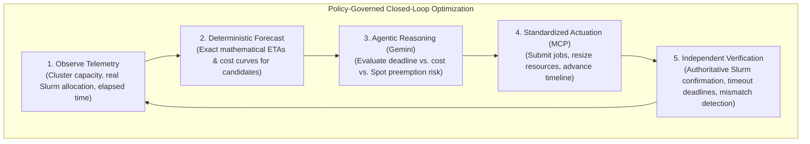
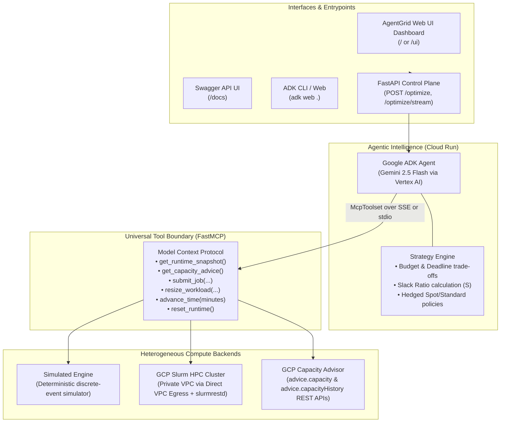
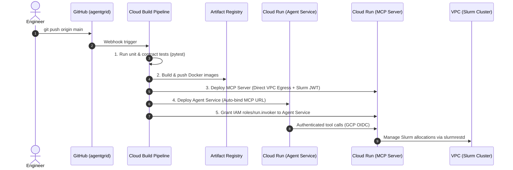

# AgentGrid

[](https://antigravity.google)
[](LICENSE)
[](https://www.python.org/)
[](https://cloud.google.com/)

> 🚀 **Built and powered with Google Antigravity** — the next-generation agentic AI platform empowering engineers to design, build, and deploy intelligent cloud infrastructure, policy-governed agentic systems, and adaptive compute optimization at scale.

**An open-source, objective-driven control plane for heterogeneous HPC and AI compute infrastructure.**

> **"Give the system a business objective, not a static resource guess."**

AgentGrid bridges business SLAs and infrastructure scheduling. By combining **deterministic forecasting software** with **policy-governed Gemini reasoning**, AgentGrid dynamically monitors, resizes, and verifies compute workloads across Slurm clusters and Cloud environments to meet execution deadlines at minimal cost.

---

## The Problem: The High Cost of Guessing Compute

In modern AI training, Monte Carlo simulations, and HPC research, resource allocation is fundamentally broken:

* **The Overprovisioning Tax**: Engineers routinely overestimate CPU, GPU, and memory requests (`--cpus-per-task`, `--mem`) to prevent job failures, wasting up to 40% of cloud budgets.
* **Deadlines vs. Costs**: Workloads have strict deadlines and financial constraints. Traditional schedulers (Slurm, Kubernetes) only manage static priority queues—they cannot reason dynamically about trade-offs between completion deadlines and budget limits.
* **Rigid Autoscaling**: Conventional reactive scalers trigger on raw infrastructure metrics (e.g., `CPU > 80%`). They cannot predict workload convergence, evaluate cost curves, assess Spot preemption risks, or verify post-actuation cluster telemetry.

---

## The AgentGrid Solution: Objective-Driven, Guardrailed Optimization

Instead of manual cluster babysitting, operators declare high-level **business intent**:

```json
{
  "objective": "Run the genomic sequence analysis. Complete before 08:00 AM under $250, minimizing overall cost."
}
```

AgentGrid continuously executes a **closed-loop control and verification cycle**, adapting workload resources within operator-defined boundaries while independently verifying cluster state.

### The Guardrailed Closed-Loop Control Cycle



---

## Flexible Operator Control: Built for Enterprise Trust

To avoid unconstrained autopilot risks, AgentGrid is designed around progressive, human-in-the-loop governance with three distinct operating modes:

1. **Advisory / Recommender Mode (Zero-Risk Observability)**:
   AgentGrid continuously evaluates cluster metrics, Amdahl speedup projections, Capacity Advisor Spot obtainability, and Slack Ratios ($S$). It generates real-time recommendations, cost deltas, and optimal configurations on the dashboard **without actuating any changes** on the underlying cluster. Operators can review and apply recommendations manually.
2. **Guardrailed Policy Mode (Bounded Autonomy)**:
   The agent is authorized to actuate resource adjustments **only within strict operator-defined guardrails** (e.g., hard vCPU caps, allowed machine types, budget ceilings, and pre-approved cluster partitions). Any candidate exceeding limits is rejected before reaching the cluster controller.
3. **Closed-Loop Verified Optimization (Continuous Adaptation)**:
   The agent actively adapts workload sizing to meet dynamic deadlines. Every actuation is subject to independent, authoritative ground-truth verification from the cluster controller before being confirmed.

---

## System Architecture

AgentGrid enforces strict boundaries between **reasoning (AI)**, **tool protocol (FastMCP)**, and **infrastructure actuation & verification (Runtimes)**. The LLM never runs raw shell commands or unrestricted cluster scripts; it operates exclusively through typed, validated compute abstractions.



---

## Deterministic vs. Agentic Responsibilities

AgentGrid operates on a fundamental principle of reliability: **never ask an LLM to perform arithmetic or validation that deterministic software executes with 100% precision.**

| Responsibility | Deterministic Backend (MCP / Runtime / Validator) | Agentic Brain (Gemini via ADK) |
| :--- | :---: | :---: |
| **Cluster Metrics** | Measures live CPU/GPU allocations & queue depth | Interprets workload health and bottlenecks |
| **Candidate Projections** | Calculates exact Amdahl speedup ETAs and cost curves | Assesses trade-offs against business targets |
| **Safety & Quota Validation** | Rejects unsupported machine types and invalid provisioning | Adheres to strict operator constraints |
| **Infrastructure Actuation** | Executes atomic REST calls to `slurmrestd` or simulator | Decides *when* and *which* candidate to scale |
| **Ground-Truth Verification** | Confirms real allocations on nodes & enforces timeouts | Explains strategy rationale to human operators |

---

## Authoritative Slurm Telemetry & Verification Engine

To prevent hallucinated states or out-of-sync cluster metadata, the Slurm adapter implements **independent ground-truth verification**:

1. **Independent State Observation**: Observed machine types (`n2-standard-2`, `c2-standard-60`, `h3-standard-88`) and provisioning modes are derived strictly from controller telemetry (e.g. partition assignment), never echoed from request parameters.
2. **Genuinely Allocated Resources**: Pending jobs with unfulfilled resource requests remain in `pending_verification` until the Slurm controller assigns active node resources (`allocated_cpus > 0`).
3. **Separation of Command Outcome & Telemetry**: Commands rejected by Slurm (HTTP 500/400) permanently remain `failed`. Ambient cluster telemetry cannot turn a rejected command into `applied`.
4. **Verification Deadlines**: An explicit verification deadline (`SLURM_VERIFICATION_TIMEOUT_SECS`) prevents stale requests from lingering in pending states.
5. **Cost Grounded in Reality**: Cost accrual is strictly calculated from verified, elapsed controller telemetry.

---

## Enterprise Spot Optimization & Hedged Provisioning

AgentGrid integrates directly with **Google Cloud Compute Engine Capacity Advisor** (`advice.capacity` & `advice.capacityHistory` REST APIs) to resolve the core dilemma in cloud HPC: **Spot VM cost reduction vs. preemption risk and SLA adherence**.

### 1. Real-Time Spot Obtainability & Preemption Intelligence
Before scaling, the system inspects:
- **Obtainability Score** (0.0 to 1.0): Likelihood of acquiring requested Spot VM pools in the target region.
- **Recommended Zone**: Automatically routes allocations to the zone with highest availability (e.g., `us-central1-f`).
- **7-Day Historical Preemption Rate**: Trailing probability of interruption to quantify SLA exposure.

### 2. Multi-Machine Family Ranking (Flex Strategy)
Workloads declare prioritized machine families with automatic fallback:
1. **Rank 1 (Modern Performance)**: `c2-standard-60` / `h3-standard-88` (Optimal compute density).
2. **Rank 2 (Broad Availability)**: `n2-standard-32` (Dependable regional capacity).
3. **Rank 3 (Granular Fallback)**: `n2-standard-16` (Smaller shape to bypass large vCPU allocation bottlenecks).

### 3. Dynamic Hedged Provisioning Policy
The optimization policy calculates the **Deadline Slack Ratio** $S$:

$$S = \frac{\text{Deadline} - \text{Elapsed Time}}{\text{Estimated Remaining Time (ETA)}}$$

* **High Slack ($S > 1.5$)**: 100% Spot VM allocation to maximize financial savings.
* **Moderate Slack ($1.1 < S \le 1.5$)**: Hedged allocation (e.g., 80% Spot / 20% Standard baseline) to buffer against preemption events.
* **Critical Slack ($S \le 1.1$) or Preemption Surge**: Immediate fallback to 100% Standard On-Demand capacity to guarantee deadline compliance.

---


---

## Six Core Product Capabilities

AgentGrid delivers an end-to-end compute control plane whose every mutation is governed by an
operator control mode. The mode is held by the server; a caller cannot grant itself permission.

### 1. Recherche de capacité compatible (Multi-Stage Capacity Search)
* **4-Stage Sourcing Lifecycle**:
  1. `catalog_proposed`: Hardware matching across CPU, memory, GPU, AVX-512 constraints.
  2. `quota_authorized`: Real-time quota check (`QUOTA_AVAILABLE`, `QUOTA_EXCEEDED`, or `QUOTA_UNKNOWN`).
  3. `capacity_estimated`: GCP Capacity Advisor signals (obtainability score 0–100%, preemption risk, uptime).
  4. `actually_allocated`: Ground-truth scheduler verification on the cluster.
* **Truthful Provenance**: Explicit distinction between `gcp_live_api`, `simulated_demo`, and `unavailable`.

### 2. Diagnostic des blocages (Blocker Diagnostic Engine)
Structured taxonomy classifying execution impediments into:
* `resource_waiting`: Cluster saturation, dynamic cloud VM spin-up wait.
* `priority`: Queued behind higher-priority workloads.
* `dependencies`: Upstream workflow dependencies or user/admin holds.
* `quota`: Project vCPU/GPU quota or Slurm QOS limits (`QOSMaxCpuPerUserLimit`).
* `capacity_shortage`: Cloud stockouts (`ZONE_RESOURCE_POOL_EXHAUSTED`), preemption spikes.
* `incompatible_configuration`: Invalid constraints (`BadConstraints`), unsupported shapes.
* `application_error`: Non-zero exit codes (e.g. exit 137 OOM, exit 139 SIGSEGV) with targeted remediations.

### 3. Comparaison déterministe de plans (Deterministic Plan Comparison)
* **3 Readable Plans**:
  * **Cost-Optimized**: Lowest estimated spend meeting deadline (Spot instances, right-sized cores).
  * **Deadline-Favored**: Fastest time to result within budget (high parallelism, Standard On-Demand).
  * **Balanced Trade-off**: Hedged allocation balancing cost and preemption SLA (e.g., 80% Spot / 20% Standard).
* **Cost & Time Transparency**:
  * Cost inclusions (`vm_compute_hourly`) and known exclusions (`network_egress`, `persistent_disk_storage`).
  * Time breakdown: Wait/Boot, Environment Prep, Active Execution (Amdahl scaling model), Checkpoint Recovery.
* **Unfeasible Handling**: Zero hallucinated winning plans. If constraints conflict, returns an empty plan set with an explicit explanation of blocking constraints and suggested relaxations.

### 4. Exécution et repli contrôlés (Operator Governance & Fallback)
* **3 Operator Control Modes**:
  * **Advisory (`advisory`)**: Strictly read-only suggestions. All mutations/submissions are rejected.
  * **Validation (`validation`)**: Human-in-the-loop approval. Plan execution blocked until operator clicks "Approve".
  * **Delegation (`delegation`)**: Execution bounded by `DelegationPolicy` guardrails (budget
    ceiling, allowed machine types, allowed regions, allowed provisioning models, retry count)
    without stopping for each approval.
* **The delegated budget is a cumulative ceiling, reconstructed server-side.** It is not a
  per-action check. Before each submission the server sums what this workload has already
  committed — every ledger row in `claimed`, `submitted` or `uncertain` state, priced at claim
  time — and adds the plan being proposed. A caller may pass its own `accumulated_cost_eur`, but
  the server takes `max(caller, ledger)`, so a caller can only ever *tighten* the bound. Three
  distinct 8 EUR plans under a 10 EUR delegation therefore yield one submission and two refusals,
  not three jobs. `GET /api/workloads/{id}/control` reports `committed_cost_eur` and
  `remaining_delegated_budget_eur` so the headroom is visible. A `failed` submission created
  nothing and is not charged; an `uncertain` one may have, so it is. Ledger rows written before
  submissions were priced are surfaced as `unpriced_prior_submissions` rather than counted as
  free. The same rule applies to every rung of the fallback ladder.
* **The retry ceiling is enforced the same way.** `max_retries` was checked but never fed an
  attempt count, so it never fired: with `max_retries: 1`, four distinct plans produced four
  jobs. Every claim ever won for a workload is now counted as a launch, and releasing a claim
  archives it instead of deleting it — otherwise a release-and-retry loop erases its own history
  and runs forever. A released `submitted` or `uncertain` claim also keeps its cost charged: a
  job existed, or may have, and authorising another try is not a refund. A released `failed`
  claim created nothing and is refunded.
* **Execution Safety**:
  * **Ordered Fallback Ladder**: Automatic failover (e.g., Spot → Standard On-Demand) when stockouts occur, staying within remaining budget.
  * **Idempotent Anti-Duplicate Submission**: A submission is claimed in a persistent SQLite
    ledger, keyed by workload and plan fingerprint, *before* the runtime is touched. The claim
    is the primary key itself, so a double click, a replayed HTTP request or a process restart
    resolves to the same job id instead of creating a second job. An ambiguous timeout is
    resolved by looking up that identity, not by guessing.
  * **Safe Downscaling**: Automatically releases temporary allocations and resizes cluster to baseline upon completion or cancellation.

### 5. Suivi et reprise (Lifecycle Management & Resumption)
* **Lifecycle States**: `DEFINED` → `PLANNING` → `READY_FOR_APPROVAL` → `SUBMITTING` → `QUEUED` → `RUNNING` → `COMPLETED` / `PREEMPTED` / `FAILED` / `CANCELLED`.
* **Observable Progress**: Three states, never conflated — `measured` (read from the runtime),
  `declared_unverified` (a figure someone stated, including the language model through the MCP
  tools) and `unavailable`. A declared cost is stored with `cost_status="estimated"`; only the
  runtime adapter produces `calculated_from_usage`.
* **Checkpoint Resumption vs. Full Restart**: The checkpoint location is *inspected* before a
  resume is promised. A local path is read; a `gs://` URI is listed when the GCS client is
  available. Three outcomes are distinguished — `verified_present`, `verified_absent` and
  `unverified` — and a retry only records a recovery against a checkpoint verified present.
  A workload with previous attempts and a demonstrably empty location is told it restarts
  from 0% rather than being promised a resume that does not exist.
* **Bounded Retries**: Enforces strict `max_retries` ceiling to protect operator budget from runaway crash loops.

### 6. Coût réel, historique et comparaison aux estimations (3-Tier Cost Reconciliation)
* **Persistent SQLite Storage**: Preserves workload profiles, plans, attempts, and post-mortems across application restarts (`~/.agentgrid/agentgrid_history.db` or `AGENTGRID_DB_PATH`).
* **3-Tier Cost Model**:
  1. `initial_estimated_cost_eur`: Pre-execution deterministic estimate.
  2. `calculated_from_usage_eur`: Actual elapsed node-hours × verified VM rates.
  3. `reconciled_billed_cost_eur`: Verified GCP Cloud Billing export (explicitly flagged when not integrated).
* **Continuous Benchmark Calibration**: Aggregates verified work-unit execution rates and interruption frequencies into a self-calibrating benchmark table.


## What is verified, and what is not

Being precise about this matters more than the feature list. As of the current commit:

| Area | Status | How it was checked |
| :--- | :--- | :--- |
| Governance (advisory / validation / delegation), plan registration, fingerprint-bound approval, idempotent submission | **Verified** | `tests/test_http_journey.py`, `tests/test_mcp_http_governance.py`, plus a full journey run with `curl` against a live server |
| Cumulative delegated budget ceiling (server-derived, caller cannot understate it) | **Verified** | `tests/test_delegation_budget_ceiling.py` — 9 of its 10 controller tests fail against the previous code |
| Plan comparison, infeasibility explanations, constraint rejection | **Verified** | `tests/test_evolved_capabilities.py`, `tests/test_agentgrid_evolutions.py` |
| Location constraints and quota staging | **Verified** | `tests/test_capacity_location_constraints.py` |
| Lifecycle, checkpoint verification, cost accounting across attempts and restarts | **Verified** | `tests/test_checkpoint_verification.py`, `tests/test_cost_accounting_journey.py` |
| GCP quota read | **Exercised against the real API** | a live `/api/capacity-search` returned `data_provenance: gcp_live_api` with a genuine `QUOTA_EXCEEDED` |
| Execution | **Simulator only** | no VM has been provisioned by this project's test runs |
| Slurm adapter | **Mocked HTTP only** | `tests/test_slurm.py`, `tests/test_slurm_telemetry_defects.py` drive stubbed `slurmrestd` responses. **Not validated against a real cluster.** |
| Dashboard | **Compiled and rendered offline, not opened in a browser** | `tools/check_jsx.py`, `tools/render_check.py`. CSS, layout and real event dispatch are **not** covered. |
| `gs://` checkpoints | **Not verifiable in the reference environment** | `google-cloud-storage` is not installed; the result is reported as `unverified`, never as present |
| Multi-tenant authentication | **Out of scope** | governance works without it, but there is no user identity model |


## Supported Compute Runtimes

| Capability | `COMPUTE_RUNTIME=simulator` | `COMPUTE_RUNTIME=slurm` |
| :--- | :--- | :--- |
| **Target Environment** | Local developer machines, CI/CD pipelines | Production GCP HPC Slurm cluster |
| **Prerequisites** | None (pure Python discrete-event simulation) | GCP VPC with `slurmrestd` + JWT authentication |
| **Workload Scope** | Deterministic Monte Carlo simulation (`mc-001`) | Real cluster jobs (`SLURM_JOB_ID`) |
| **Transport Protocol** | `stdio` (local subprocess) or `sse` | `sse` on Cloud Run via Direct VPC Egress |
| **Actuation Mechanism** | State progression engine with Amdahl scaling | Direct `slurmrestd` REST API v0.0.41 |

---

## Quickstart (Local Development)

### 1. Prerequisites & Installation

Python 3.11+ is required.

```bash
# Clone repository
git clone https://github.com/samy-fadel/agentgrid.git
cd agentgrid

# Setup virtual environment
python3 -m venv .venv
source .venv/bin/activate
pip install -e ".[dev]"

# Configure environment
cp .env.example .env
```

### 2. Configure Gemini / Vertex AI Authentication

```bash
gcloud auth application-default login
gcloud config set project YOUR_PROJECT_ID
```

Edit your `.env` file:

```env
GOOGLE_GENAI_USE_VERTEXAI=TRUE
GOOGLE_CLOUD_PROJECT=YOUR_PROJECT_ID
GOOGLE_CLOUD_LOCATION=us-central1
AGENTIC_COMPUTE_MODEL=gemini-2.5-flash
```

### 3. Run the control plane and the dashboard

The API and the operator dashboard are one FastAPI application. It needs **no
cloud credentials** to start: capacity search, plan comparison, diagnostics,
governance, execution against the simulator, lifecycle tracking and history all
work offline. Credentials only affect the live GCP quota lookup, the Capacity
Advisor signal and the LLM-driven `/optimize` endpoints.

```bash
# from the repository root, with the environment installed as above
PORT=8080 python3 -m compute_agent.app
```

Then open `http://localhost:8080/ui` for the dashboard.

> `/` performs content negotiation: a browser (`Accept: text/html`) receives the
> dashboard, any other client receives service metadata as JSON. `/ui` and
> `/dashboard` always return the dashboard.

Useful checks:

```bash
curl -s localhost:8080/health
curl -s -X POST localhost:8080/api/capacity-search \
  -H 'Content-Type: application/json' \
  -d '{"cpu_requested": 8, "allowed_regions": ["europe-west4"]}'
curl -s -X POST localhost:8080/api/plans/compare \
  -H 'Content-Type: application/json' \
  -d '{"workload_profile": {"workload_id": "wl-demo", "cpu_requested": 8,
       "memory_mb_requested": 16384, "estimated_duration_minutes": 60,
       "budget_amount": 500}}'
```

> An unknown key in `workload_profile` is rejected with HTTP 400 naming the
> field. This is deliberate: a misspelled `budget_eur` used to be dropped
> silently, and the answer came back "feasible" without the budget ever having
> been considered.

### 4. Run the ADK playground (optional, requires Gemini credentials)

Launch the ADK graphical playground:

```bash
adk web .
```

Open your browser at `http://localhost:8000`, select **`compute_agent`**, and provide an objective:

> *"Optimize the compute workload against the configured deadline and budget. Minimize overall cost, adapt to cluster feedback, and summarize the final execution."*

Or run directly from the CLI:

```bash
adk run compute_agent
```

### 5. Tests and the offline dashboard gate

```bash
pytest -q                       # pythonpath is configured in pyproject.toml
python3 tools/check_jsx.py      # parses the dashboard's JSX offline
python3 tools/render_check.py   # renders every tab in duktape and reports errors
```

`check_jsx.py` and `render_check.py` exist because there is no Node.js and no
browser in the reference development environment. They transpile the dashboard
with the TypeScript compiler bundled in `dukpy` and execute it against a minimal
React stub. They catch syntax errors, undefined references at render time and
tabs that render nothing. **They are not a browser**: CSS, layout, real event
dispatch and network behaviour are not covered by them.

---

## Production Deployment on Google Cloud

AgentGrid deploys with automated CI/CD using **Cloud Build**, **Artifact Registry**, and **Cloud Run** with **Direct VPC Egress** connecting directly to private Slurm clusters.



### Interacting with the Cloud Run Agent

* **Interactive Web Dashboard UI**:
  Visit `https://<AGENT_SERVICE_URL>.a.run.app/` or `/ui` in your browser.
  * Real-time streaming feed of Gemini's reasoning and tool invocations via Server-Sent Events.
  * Interactive controls for Deadline (mins), Budget (€), and Cost Minimization strategy.
  * Live candidate allocation matrix with speedup curves and cost forecasts.
  * Slurm Ground-Truth verification card showing active job status, verified allocated CPUs, and cluster verification commands.

* **Slurm Verification on Cluster**:
  ```bash
  # Check active job parameters on the Slurm login node
  scontrol show job <JOB_ID> | grep -E "NumCPUs|JobState|CPUs/Task"
  squeue -j <JOB_ID> -o "%.8i %.9P %.8j %.8u %.2t %.10M %.6D %C"

  # Query the live agent snapshot API
  curl -s https://<AGENT_SERVICE_URL>.a.run.app/api/snapshot | jq .
  ```

* **Synchronous & Streaming REST Endpoints**:
  ```bash
  # Synchronous optimization
  curl -X POST https://<AGENT_SERVICE_URL>.a.run.app/optimize \
    -H "Content-Type: application/json" \
    -d '{"objective": "Meet deadline while minimizing compute cost under queue pressure."}'

  # Real-time SSE stream
  curl -N -X POST https://<AGENT_SERVICE_URL>.a.run.app/optimize/stream \
    -H "Content-Type: application/json" \
    -d '{"objective": "Meet deadline while minimizing compute cost under queue pressure."}'
  ```

---

## 6 Target Operational Capabilities

AgentGrid delivers 6 core operational capabilities for intelligent compute management:

1. **Recherche de capacité compatible & Validation des quotas** (`search_capacity`, `search_compatible_capacity`):
   - Traces candidates across 4 distinct lifecycle stages: `catalog_proposed` -> `quota_authorized` -> `capacity_estimated` -> `actually_allocated`.
   - Explicit data provenance (`gcp_live_api`, `simulated_demo`, `unavailable`, `unknown`) without silent demo masking.
2. **Diagnostic structuré des blocages** (`diagnose_blockers_tool`, `diagnose_blockers`):
   - Categorizes impediments into: `resource_waiting`, `priority`, `dependencies`, `quota`, `capacity_shortage`, `incompatible_configuration`, `application_error`.
   - Distinguishes observed facts from hypotheses, identifies origins, and generates concrete remediation actions with trade-off consequences.
3. **Moteur déterministe de comparaison de plans** (`compare_plans`, `evaluate_and_compare_plans`):
   - Generates up to 3 distinct candidates: `cost_optimized`, `deadline_favored`, and `balanced_tradeoff`.
   - Transparent cost scope (compute vs network/storage exclusions) and Amdahl scaling model.
   - When constraints are unfeasible, explains factually what blocks without inventing an imaginary winner.
4. **Exécution gouvernée & Repli contrôlé** (`execute_plan_controlled`, `ExecutionController`):
   - **3 Operator Control Modes**:
     * **Conseil (Advisory)**: Strictly read-only recommendations; rejects any infrastructure mutation.
     * **Validation**: Prepares execution plans; blocks execution until explicit human operator approval.
     * **Délégation**: Autonomous execution bounded by strict `DelegationPolicy` guardrails (max budget, machine types, regions, retry counts).
   - Ordered fallback ladder (Spot -> Standard / alternative shapes) verifying remaining budget.
   - Anti-duplicate idempotent submission across network timeouts.
   - Safe downscaling protecting active compute nodes from termination.
5. **Suivi du cycle de vie et reprise** (`track_workload_lifecycle`, `LifecycleManager`):
   - Clean separation between compute identity (`workload_id`) and attempt history (`attempt_id`).
   - Checkpoint resumption is granted only against a checkpoint that was actually inspected;
     a location that cannot be read is reported as `unverified` and the resume is declared
     unproven rather than promised.
   - Strict rejection of inconsistent partial resumptions for non-interruptible workloads.
6. **Coûts réels, historique persistant et étalonnage** (`get_cost_history`, `HistoryStore`):
   - Persistent disk storage (SQLite / JSON) surviving application restarts.
   - Explicit 3-tier cost breakdown: Initial Estimate vs Calculated from Usage vs Reconciled Billed Cost.
   - Comparable workload metrics for runtime calibration.

---

## Project Structure

```text
├── cloudbuild.yaml           # Automated CI/CD pipeline for Cloud Run
├── Dockerfile.agent          # Container definition for ADK Agent Service
├── Dockerfile.mcp            # Container definition for FastMCP Server
├── pyproject.toml            # Package metadata, dependencies, and entrypoints
│
├── compute_agent/            # Agent Service Layer
│   ├── agent.py              # Google ADK root_agent (Gemini + McpToolset with 6 capability tools)
│   ├── app.py                # FastAPI HTTP REST API, SSE streaming & Web Dashboard UI
│   ├── auth.py               # GCP OIDC token generator for IAM service-to-service
│   └── static/
│       └── index.html        # Interactive AgentGrid Web Dashboard (React tabs for all 6 features)
│
├── src/agentic_compute/      # Domain Logic & Compute Boundary
│   ├── models.py             # Universal semantic abstractions, WorkloadProfile, ExecutionPlan
│   ├── runtime.py            # RuntimeAdapter universal interface with Control Modes
│   ├── simulator.py          # Deterministic discrete-event simulation runtime
│   ├── slurm_adapter.py      # Production Slurm REST API adapter (v0.0.41) & verification engine
│   ├── capacity_advisor.py   # GCP Compute Engine Capacity Advisor & quota verification client
│   ├── capacity_search.py    # 4-stage capacity candidate search engine
│   ├── diagnostics.py        # 7-category structured blocker diagnostic classifier
│   ├── diagnostic.py         # Slurm & GCP blocker diagnostics interface
│   ├── plan_engine.py        # Deterministic 3-plan comparison engine
│   ├── execution_controller.py # Control mode gate, fallback ladder & idempotent executor
│   ├── lifecycle_manager.py  # Workload attempt tracker & checkpoint resume coordinator
│   ├── history.py            # Persistent SQLite execution store & 3-tier cost reconciler
│   ├── history_store.py      # File-based JSON historical calibration store
│   └── mcp_server.py         # FastMCP Server (dual SSE & stdio transports with 10 tools)
│
├── scripts/
│   ├── deploy_services.sh    # Cloud Run deployment & IAM binding script
│   └── setup_ci_cd.sh        # Setup script for Artifact Registry, triggers, and IAM
│
└── tests/                    # Comprehensive test suite (75 unit, contract & capability tests)
    ├── test_agent_service.py # API & endpoint contract tests (9 tests)
    ├── test_mcp_contract.py  # FastMCP interface & Capacity Advisor tests (13 tests)
    ├── test_simulator.py     # Simulator progression & candidate tests (5 tests)
    ├── test_slurm.py         # Slurm adapter verification, lifecycle & timeout tests (23 tests)
    ├── test_agentgrid_evolutions.py # Focused evolution capability tests (13 tests)
    └── test_evolved_capabilities.py # Section 11 end-to-end validation scenarios (12 tests)
```

---

## Roadmap

- [x] Universal compute semantic models (`ClusterState`, `WorkloadState`, `CandidateAllocation`).
- [x] FastMCP server supporting dual transports (`stdio` local, `sse` remote).
- [x] Deterministic discrete-event simulation runtime.
- [x] Production Slurm REST API adapter (`slurmrestd` v0.0.41).
- [x] Authoritative ground-truth verification engine with timeout deadlines & mismatch detection.
- [x] GCP Capacity Advisor integration with Spot obtainability, preemption history & Slack Ratio $S$.
- [x] Automated CI/CD with Google Cloud Build & Cloud Run Direct VPC Egress.
- [ ] Multi-agent orchestration (Planner Agent + Cost Guardian Agent + Cluster Watchdog).
- [ ] Kubernetes / GKE Ray cluster runtime adapter.

---

## License

This project is licensed under the Apache License, Version 2.0. See the [LICENSE](LICENSE) and [NOTICE](NOTICE) files for details.
